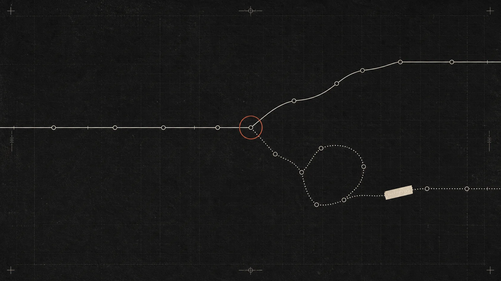

<div align="center">

<picture>
  <source media="(prefers-color-scheme: dark)" srcset="web/public/brand/kibitz-mark-dark.svg">
  
</picture>

# Kibitz

**장기 실행 에이전트를 위한 오픈소스 트레이싱.**

에이전트가 *무엇을 결정했고 왜 그랬는지* 보여주는 self-hosted 옵저버빌리티.<br>
초 단위가 아니라 시간 단위로 도는 런을 위해 만든, Langfuse 핵심 tracing 작업 흐름의 대체재.

<p>
<a href="./LICENSE"></a>


</p>

**[빠른 시작](./docs/quickstart.md)** · [문서](./docs/README.md) · [개념](./docs/concepts.md) · [Langfuse에서 이전](./docs/migration-from-langfuse.md) · [디자인](./DESIGN.md) · **[English](./README.md)**

<br>



</div>

<br>

> **kibitz** *(v.)* — 체스에서 옆에 서서 지켜보며 훈수를 두는 것.

---

## 문제

에이전트가 몇 번의 LLM 호출로 끝날 때는 span tree만으로 충분했다. 지금의 에이전트는 수백 번 도구를
쓰고, 사람의 추가 지시를 받고, 컨텍스트를 압축하며, 몇 시간 동안 코드와 데이터를 바꾼다.
"어느 함수가 느렸나"는 더 이상 질문이 아니다.

<table>
<tr><td width="50%" valign="top">

**span tree가 답하는 것**

- 이 호출은 얼마나 걸렸나?
- 어느 span에서 예외가 났나?
- 토큰을 얼마나 썼나?

</td><td width="50%" valign="top">

**정작 알아야 하는 것**

- 어떤 사용자 의도 아래서 이 호출이 일어났나?
- 상태가 진전된 구간과 같은 일을 반복한 구간은 어디인가?
- 이전 지시와 근거가 언제 컨텍스트에서 약해졌나?
- 최종 결과의 숫자와 주장은 어느 observation에서 왔나?
- 실패한 선택 대신 무엇을 했어야 했나?

</td></tr>
</table>

Kibitz는 표준 trace tree를 버리지 않는다. 그 위에 **요청 묶음, 결정 경로, 근거가 붙은 finding,
counterfactual**을 1급 객체로 추가한다.

---

## 현재 구현된 core

| 작업 | 지원 |
| :-- | :-- |
| **직접 만든 agent 계측** | async-safe Python SDK, TypeScript SDK, LangChain/LangGraph 콜백 핸들러 |
| **code agent 추적** | Claude Code·Codex JSONL snapshot 또는 `--watch` 연속 import |
| **다른 런타임** | OTLP/HTTP JSON 수신, 또는 완성된 Kibitz Run JSON `POST` |
| **Langfuse 이전** | v4 `observations_v2` JSON·JSONL·API 응답 import |
| **관측** | 중첩 trace, request group, session/user/tag, latency·token·추정 비용 |
| **진단** | 동일 호출, tool cycle, empty-result loop, cache break, context eviction, unsourced number |
| **개선 제안** | 선택 — API key, Ollama, 또는 로그인된 Claude Code·Codex 계정 |
| **평가 workflow** | 영속 prompt·dataset·evaluator·annotation·automation resource API |
| **운영** | atomic file write, 공유 RWX volume, project-scoped read/ingest/admin token |

Prompt·dataset·evaluator·annotation queue·automation resource는 trace와 분리된 영속 저장소와
CRUD API를 사용한다. 기본 예시는 저장된 resource가 하나도 없을 때만 보인다.

---

## 160턴 런이 6줄

LangSmith의 run tree와 같은 형태다. 계층은 우리가 만든 게 아니라 **기록에 이미 있다.**
사용자 요청 하나가 다음 요청까지의 모든 작업을 지배하고, 그 경계가 곧 묶음이다.

```text
chain  사용자 요청                       14.4K tok · 27.9초   ← 접으면 아래 전부의 합계
  retriever  search(q="Q3 revenue")     0건  ⚠ 비효율
  retriever  search(q="Q3 revenue")     0건  ⚠ 오류 (같은 인자)
  tool       compute(merge)
  llm        draft()                         ⚠ 오류 (출처 없는 숫자)
```

트리를 만들면서 계측 정확도 문제 네 가지가 드러났고 함께 고쳤다.

| 문제 | 크기 | 원인 |
| :-- | :-- | :-- |
| 툴 결과가 사용자 요청으로 계상 | 요청 27건 → 65건 | `flatten()`이 `tool_result` 중첩 content까지 펼쳤다 |
| 시스템 주입 라인이 "사람 개입" | +11.6% | `[Request interrupted…]`·`[Image: …]`은 요청이 아니다 |
| 사람이 자리를 비운 시간이 "지연" | 한 런에서 66시간 → 27.7분 | 이벤트 간격은 에이전트 작업과 사람의 부재를 함께 담는다 |
| 한 메시지의 병렬 툴 호출이 토큰 중복 계상 | +0.1% | `usage`는 메시지 단위인데 호출마다 복제했다 |

`[Image: …]`은 버리지 않고 **첨부(attachment)** 로 모델링했다 — LangSmith의 1급 개념이고 실측
데이터에 실제로 있다. `[Request interrupted…]`는 요청이 아니지만 사람의 행동은 맞으므로 묶음 안의
`event`로 둔다.

정확도의 분모도 바꿨다. 사용자 요청은 에이전트의 판단이 아니므로 세지 않는다. 세면 요청이 많은
런일수록 정확도가 공짜로 올라간다.

---

## 실행

<table>
<tr><td valign="top" width="50%">

**로컬 개발**

```bash
# 1. 앱 (합성 픽스처 9건이 들어 있어
#    빈 화면이 아니다)
pnpm --dir web install
pnpm --dir web dev

# 2. 내 코드 에이전트 세션을 읽어 온다
uv run --project agent \
  python -m kibitz_ingest.cli --source all --limit 8
```

</td><td valign="top" width="50%">

**Docker**

```bash
cp .env.example .env
docker compose up -d
```

<http://localhost:3000> 을 연다.

```bash
pnpm --dir web build   # 프로덕션 빌드
pnpm --dir web lint
```

</td></tr>
</table>

요구 사항: Node.js 20 이상 + pnpm, Python 3.12 이상 + uv. 전체 안내는
[`docs/quickstart.md`](./docs/quickstart.md), 셀프호스팅은
[`docs/self-hosting.md`](./docs/self-hosting.md).

---

## 세 가지 방법으로 트레이스가 들어온다

| 방법 | 대상 | 문서 |
| :-- | :-- | :-- |
| **인제스터** | Claude Code·Codex 세션 기록 | [ingestion.md](./docs/ingestion.md) |
| **SDK** | 코드로 만든 에이전트 (`@tool`, LangChain 콜백) | [sdk.md](./docs/sdk.md) |
| **HTTP / OTLP** | 무엇이든 — `POST /api/traces` 또는 `/api/otel` | [sdk.md](./docs/sdk.md) |

```python
from kibitz_sdk import trace, tool

@tool
def search(query: str) -> list[str]: ...

with trace("월간 리포트", agent="sales-reporter", model="claude-opus-5") as run:
    with run.request("3분기 매출 정리해줘"):
        ids = search("revenue 2026 Q3")
        run.answer(summarize(ids), input_tokens=1200, output_tokens=180)
```

> [!IMPORTANT]
> 어느 쪽이든 **탐지 규칙은 한 벌**이다 (`agent/kibitz_ingest`). SDK도 그 코드를 import 해서
> 트레이스를 만들고, 서버는 저장만 한다. 규칙을 TypeScript로 옮기면 두 구현이 생기고 반드시
> 갈라진다. 그러면 "SDK 트레이스의 판정과 Claude Code 트레이스의 판정이 다르다"가 되고, 둘을
> 나란히 볼 이유가 없어진다.

---

## 탐지 규칙

판정을 만드는 여섯 규칙은 **전부 LLM 없이** 계산된다.

| 규칙 | 계산 방법 |
| :-- | :-- |
| `repeated-call` | `hash(도구, 인자)` 일치 **且** 사이 구간에 그 대상 쓰기 없음 |
| `call-cycle` | 호출 시퀀스에 길이 2 이상 반복 부분열 |
| `empty-result-loop` | 빈 결과 이후 같은 도구·같은 인자 |
| `context-eviction` | 직전 호출의 message id가 다음 실제 message 목록에서 사라짐 |
| `cache-break` | 캐시 읽기 급락 + 캐시 쓰기 급증 = 프리픽스 소실 |
| `unsourced-number` | 출력의 숫자 리터럴 ∉ (도구 출력 ∪ 사용자 입력) |

> [!NOTE]
> **LLM 판정(LLM-as-judge)은 쓰지 않는다.** 모델에게 "이거 잘했니?"를 묻는 순간 그 답 자체가 또
> 하나의 환각 후보가 되고, 사람은 그걸 검증할 수 없다. 그래서 `unsourced-number`도 의미 수준
> 검증을 하지 않고 숫자 리터럴만 문자열로 대조한다. 범위가 좁고 표기 변화에 민감하지만, 근거를
> 그대로 화면에 띄울 수 있다.
>
> 같은 이유로 모델의 자기보고(확신도)나 추정 점수는 데이터 모델에 없다.

---

## 실측 검증 — Claude Code·Codex 세션으로 돌렸다

탐지 규칙을 직접 만든 에이전트로 검증하면 자기 채점이다. 대신 **우리가 만들지 않은 진짜 에이전트
런** — Claude Code의 세션 기록(`~/.claude/projects/**/*.jsonl`) — 으로 돌렸다. 툴 호출 인자·토큰·
타임스탬프가 전부 실측이라 **API 키도 비용도 들지 않는다.**

```bash
uv run --project agent python -m kibitz_ingest.cli --source all --limit 8
```

세션 8건(툴 호출 1,851회)에서 원시 신호를 직접 센 결과:

| 신호 | 발생 | 비율 |
| :-- | --: | --: |
| 동일 인자 재호출 | 135건 | 7.3% |
| 빈손 결과 | 118건 | 6.4% |
| 프리픽스 캐시 급락 | 10건 | — |

**여기서 정밀도 문제를 하나 찾았다.** 파일을 고친 뒤 다시 읽는 것은 정당한 재확인인데 해시만 보면
반복과 구분되지 않는다. 두 호출 사이에 그 대상에 대한 쓰기가 있었는지를 함께 보도록 고쳤다 —
그것도 기록에 있는 값이라 여전히 결정론이다. 이 보정 후 `repeated-call` 6건 · `call-cycle` 8건이
남았고, 그중 6건은 **이 프로젝트를 만든 세션 자신의 중복 호출**이다.

<details>
<summary><b>실제 데이터가 드러낸 다른 결함들 (과 수정)</b></summary>

<br>

- 누적 진척을 파일 경로로만 세어 웹 조사 구간이 통째로 0으로 보였다.
- 되돌아가는 호가 8개일 때 라벨이 서로 덮어썼다.
- 22분짜리 런이 `1336.0초`로 표기됐다.
- 160턴 런의 압축 리본이 옆 칼럼을 밀고 나가 겹쳐 그려졌다.
- Tailwind 4가 유틸리티로 참조되지 않는 순차 램프 변수를 통째로 떨어뜨려 점수 매트릭스 칸이
  투명하게 나왔다.
- 규칙 이름도 하나 갈랐다. 캐시 프리픽스가 깨진 것을 `context-eviction`으로 부르고 있었는데,
  규칙 설명("message id가 사라짐")과 실제 계산(캐시 읽기 급락)이 달랐다. 근거로 쓰려면 이름과
  계산이 글자 그대로 맞아야 하므로 `cache-break`를 분리했다.

</details>

---

## 화면

Langfuse의 엔티티 축(세션·사용자·스코어·평가자·어노테이션·데이터셋·프롬프트)과 LangSmith의 작업
흐름(중첩 run tree·워터폴·속성 필터·automation rule·baseline 비교·playground·thread)을 같은 데이터
위에 얹었다. `Run ↔ Trace`, `Turn ↔ Observation`.

| 경로 | 화면 |
| :-- | :-- |
| `/` | 랜딩 — 이 빌드에 담긴 트레이스에서 실제로 센 숫자만 쓴다 |
| `/dashboard` | 비용·지연·토큰 시계열, 모델별 비교, 스코어 분포, 실패 유형 |
| `/traces` | 목록 — 속성 필터 빌더(AND/OR), 저장된 뷰, 컬럼 설정 |
| `/traces/[runId]` · `…/timeline` | 요약 → **중첩 run tree + 워터폴** → 관측 상세 탭 |
| `/threads` · `/threads/[id]` | 스레드 — 요청 묶음을 대화로 이어서 |
| `/playground` | 기록된 호출을 편집 + 실행 스니펫 생성 (모델을 부르지 않는다) |
| `/automations` | 규칙 — 필터 → 샘플링 → 액션. 지금 무엇을 잡는지 실제로 계산해 보여준다 |
| `/sessions` · `/users` | 이어지는 작업 단위별 · 최종 사용자별 집계 |
| `/scores` · `/evaluators` · `/annotation` | 스코어 분포 · 평가자 · 사람 검토 큐 |
| `/datasets` · `/datasets/[id]` | 데이터셋 + 실행 비교 매트릭스 |
| `/prompts` · `/prompts/[name]` | 프롬프트 버전 · 라벨 · 버전 간 diff |
| `/failures` | 실패 유형 — 같은 패턴의 런을 묶어서 |
| `/settings` | 언어 전환, 탐지 규칙 전문, Claude Code·Codex 계정 연결 상태 |

---

## Langfuse에서 넘어온다면

| Langfuse | Kibitz | 상태 |
| :-- | :-- | :-- |
| Trace | Run / Trace | Core |
| Observation / Span | Observation / Turn | Core |
| Session | Session | Core, trace metadata에서 파생 |
| User | User | Core, trace metadata에서 파생 |
| Score | Derived score | Core, trace에서 결정론적으로 파생 |
| Evaluator | Evaluator + resource API | 영속 |
| Annotation queue | Annotation 화면 + 저장 action | 영속 |
| Dataset / experiment | Dataset + resource API | 영속 |
| Prompt management | Prompt version explorer + resource API | 영속 |

Kibitz가 그 위에 더하는 것: request boundary 기반 접기, 반복 호출을 되돌아가는 호로 나타내는
decision path, cache와 context 변화, 원인이 된 observation에 붙는 evidence-backed finding,
관측값 → 규칙 → counterfactual. 이전 경로와 안전한 공존 순서는
[`docs/migration-from-langfuse.md`](./docs/migration-from-langfuse.md).

---

## 구조

**백엔드 교체 지점은 [`web/lib/data.ts`](./web/lib/data.ts) 하나다.** 화면은 이 모듈만 보고, 모든
함수가 async라 본문을 fetch로 바꾸면 컴포넌트는 손대지 않아도 된다.

<details>
<summary><b>저장소 레이아웃</b></summary>

```text
web/
  app/
    (site)/page.tsx        랜딩 (앱 셸 없음)
    (app)/                 앱 셸이 붙는 영역 — 셸을 pathname으로 조건부 렌더하지 않는다
  components/
    run-tree.tsx           중첩 관측 트리 + 워터폴
    split-pane.tsx         리사이즈 분할 — pointer capture, 드래그 중 트랜지션 없음
    filter-builder.tsx     속성 필터 빌더 + 저장된 뷰 + 필터 숏컷
    command-palette.tsx    ⌘K — 애니메이션 없음 (하루 수백 번 쓰는 것)
    journey-map.tsx        경로 지도 — 반복 호출을 되돌아가는 호로
    context-stream.tsx     컨텍스트 스트림 — 밀려나는 과정
    provenance.tsx         출처 연결선 — 숫자 → 출처 턴
    viz.tsx                Sparkline · MiniRibbon · Scorecard · EvidenceList · ContextXray
    charts.tsx             차트 프리미티브 (축 하나, 검증된 팔레트, 표 대체 보기)
    trace-explorer.tsx     결정 타임라인 (경로/컨텍스트 + 서사 + 증거)
    i18n-provider.tsx      클라이언트 로케일 컨텍스트 + 언어 전환
  lib/
    tree.ts                관측 트리 조립 + 자손 합계. 트리는 저장하지 않는다
    query.ts               속성 필터 — 파싱·매칭·직렬화·쿼리 문자열
    automations.ts         규칙 엔진 (드라이런)
    persisted.ts           localStorage를 useSyncExternalStore로. effect 안 setState 금지
    types.ts               도메인 모델 — Turn / Verdict / Counterfactual + Langfuse 엔티티
    i18n/                  dictionaries.ts (en이 타입 원천) · shared.ts · index.ts
    data.ts                데이터 접근 계층  ← 유일한 백엔드 교체 지점
    entities.ts            런에서 세션·사용자·스코어를 파생. 화면끼리 숫자가 어긋나지 않게
    verdict.ts             색·포매터. 색은 여기서만 결정된다

agent/
  kibitz_ingest/           세션 기록 → 트레이스. **탐지 규칙이 사는 유일한 곳**
    core.py                규칙·해시·비용·제목
    build.py               이벤트 → 트레이스 (어댑터 공통)
    adapters/              claude_code.py · codex.py
    cli.py                 python -m kibitz_ingest.cli --source all
  kibitz_sdk/
    tracer.py              trace() · run.request() · run.span() · @tool
    client.py              파일 또는 HTTP 전송 (실패해도 에이전트를 죽이지 않는다)
    langchain.py           LangChain/LangGraph 콜백 핸들러
  kibitz_mcp/              MCP 서버

sdk/typescript/            TypeScript SDK
docs/                      셀프호스팅 · 인제스션 · SDK · 탐지 · 설정 · 보안
docker-compose.yml         web + ollama(프로파일)
prototype/                 초기 단일 파일 프로토타입 (참고용)
DESIGN.md                  디자인 시스템 9섹션
```

</details>

---

## 디자인 원칙

<details>
<summary><b>색 규율 — 총 3색</b></summary>

<br>

무채색이 기본이다. 색은 **주의가 필요한 것**에만 쓴다.

```text
sky   #6FC7FF   선택·포커스 전용 (상태 아님)
warn  #D9A441   비효율 — 결과는 얻었으나 낭비
crit  #E5484D   오류 — 결과가 틀렸다
```

정상 진행과 사람 개입은 **색을 쓰지 않는다.** 성공은 기본값이고 기본값은 소리치지 않는다.
Vercel이 `--color-success`와 `--color-warning`을 회색(`#8f8f8f`)으로 두고 danger에만 색을 주는
것과 같은 규율이다.

라이트에서는 상태색을 내려야 한다 — 흰 배경 위의 amber/red는 텍스트로 못 읽는다.
`warn #8a5a00` · `crit #c0272d` · `sky #0b6bcb` 로 전부 4.5:1을 넘긴다.

</details>

<details>
<summary><b>테마 — 라이트/다크, 계산으로 검증</b></summary>

<br>

시스템 설정을 따르고 수동 전환도 된다. `<head>` 인라인 스크립트가 첫 페인트 전에 클래스를
정하므로 깜빡임이 없다.

**순차 램프는 테마마다 방향이 뒤집힌다.** 다크에서는 어두움=낮음, 라이트에서는 밝음=낮음이어야
한다 — 그러지 않으면 흰 배경에서 낮은 값이 가장 도드라진다. 두 램프 모두 OKLab 명도 단조성과 셀
텍스트 대비를 **계산으로** 확인했다(최저 6.7:1 / 7.5:1). 카테고리 팔레트는 검증 스크립트를 두 표면
모두에서 통과한다.

전에는 경계·hover를 `white/10`처럼 직접 썼는데 그건 다크에서만 성립한다. 120곳을
`hair`/`line`/`line-2`/`line-3`/`hover`/`fill`/`fill-2` 토큰으로 뽑아 테마마다 뒤집는다.

</details>

<details>
<summary><b>다국어 — 영어 기본 / 한국어</b></summary>

<br>

로케일은 쿠키(`kibitz_locale`)에 있고 URL 접두사가 없다. `lib/i18n/dictionaries.ts`의 `en`이
**타입의 원천**이라, `ko`에서 키를 빠뜨리면 번역 누락이 런타임이 아니라 컴파일에서 잡힌다.

핵심 규칙 하나: **데이터에 사람 말을 넣지 않는다.**

- 국면·판정·근거 항목·컨텍스트 구성은 전부 **키**로 저장하고 문자열은 사전에서 온다
  (`Phase = "plan" | "gather" | ...`, `Evidence.label: EvidenceKey`).
- 판정의 headline/why/대안 경로는 `VerdictNote`에 **없다** — `kind`로 사전에서 뽑는다. 규칙이 곧
  문장이므로, 데이터에 넣으면 같은 문장이 런 수만큼 복제되고 번역이 불가능해진다.
- 반대로 **에이전트 자신의 말**(턴 제목, 출력, 사용자 발화)은 번역하지 않는다. 실제 런에서 모델이
  한 말을 우리가 고쳐 쓸 수는 없다.

영어 단복수는 `makeTranslate`가 처리한다 — `n === 1`이면 `<키>_one`을 먼저 찾는다.
`1 turns saved` 같은 문장이 나가지 않게.

</details>

---

## 더 깊게 만들 영역

- [ ] **컨텍스트 구성의 역할별 분해** — Claude Code 기록에는 실제 전송 payload가 없어 캐시
      계층(읽기·쓰기·신규 입력)까지만 실측된다. 역할별로 쪼개려면 SDK 훅이 필요하다.
- [ ] **`unsourced-number` 정규화** — `₩8.24B` vs `8,240,000,000` 같은 표기 차이를 다뤄야 한다.
- [ ] **OTLP protobuf/gRPC transport** — 현재 receiver는 표준 OTLP/HTTP JSON을 받는다.
- [ ] **Langfuse SDK 호환 facade** — 진짜 drop-in 교체가 필요한 설치를 위해.

---

## 기여

이슈와 PR을 환영한다. PR 전에:

```bash
pnpm --dir web lint && pnpm --dir web typecheck && pnpm --dir web build
uv run --project agent pytest
```

탐지 규칙은 **한 곳에만** 산다(`agent/kibitz_ingest`). 판정을 추가하는 변경이라면 그 판정을 계산해낸
관측값도 함께 추가해야 한다 — 근거 없는 판정은 머지할 수 없다.

> [!WARNING]
> `web/lib/mock/traces.json` 에는 **실제 세션 내용이 담긴다** — 프롬프트, 파일 경로, 프로젝트명이
> 그대로 들어간다. 그래서 gitignore 되어 있다. 이 저장소를 포크하거나 공개할 계획이면 인제스터를
> 다시 돌려 빈 배열로 만들거나 리다크션을 붙이고 커밋할 것. `data.ts`가 이 파일을 정적 import
> 하므로 파일 자체는 존재해야 빌드가 된다. `traces.sample.json`(빈 배열)을 `pnpm dev`/`pnpm build`
> 가 자동으로 복사해 준다.

---

## 라이선스

[Apache-2.0](./LICENSE). 사용·수정·재배포 조건은 라이선스를 참고.

<div align="center">
<br>
<sub>당신의 에이전트 어깨 너머로 훈수를 두기 위해 만들었습니다.</sub>
</div>
