<div align="center">

<picture>
  <source media="(prefers-color-scheme: dark)" srcset="web/public/brand/kibitz-mark-dark.svg">
  
</picture>

# Kibitz

**Open-source tracing for long-running agents.**

Self-hosted observability that shows what your agent *decided* — and why.<br>
A drop-in replacement for the core Langfuse tracing workflow, built for runs that last hours, not seconds.

<p>
<a href="https://kibitz-trace.vercel.app"></a>
<a href="./LICENSE"></a>


</p>

**[Live demo](https://kibitz-trace.vercel.app)** · [Quickstart](./docs/quickstart.md) · [Docs](./docs/README.md) · [Concepts](./docs/concepts.md) · [Migrate from Langfuse](./docs/migration-from-langfuse.md) · [Design](./DESIGN.md) · **[한국어](./README.ko.md)**

<sub>The demo runs on the dataset below with ingestion closed — nothing you send it will be stored.</sub>

<br>


<sub>⌘K to jump anywhere. Every screen above runs on the same trace data.</sub>

</div>

<br>

> **kibitz** *(v.)* — to stand behind a chess player, watch every move, and offer advice they did not ask for.

---

## The problem

When an agent made three LLM calls, a span tree was enough. Today's agents call tools hundreds of
times, take mid-run corrections from a human, compact their own context, and edit real code and data
for hours. "Which function was slow?" stopped being the question.

<table>
<tr><td width="50%" valign="top">

**What span trees answer**

- How long did this call take?
- Which span threw?
- How many tokens did it burn?

</td><td width="50%" valign="top">

**What you actually need to know**

- Under which user intent did this call happen?
- Where did state advance, and where did it loop?
- When did an earlier instruction fall out of context?
- Which observation produced the number in the final answer?
- What should it have done instead?

</td></tr>
</table>

Kibitz keeps the standard trace tree. On top of it, **request groups, decision paths,
evidence-backed findings, and counterfactuals** become first-class objects.

---

## What's in the box

| Job to be done | Supported today |
| :-- | :-- |
| **Instrument your own agent** | async-safe Python SDK, TypeScript SDK, LangChain / LangGraph callback handler |
| **Trace a coding agent** | Claude Code + Codex JSONL snapshot, or `--watch` for continuous import |
| **Any other runtime** | OTLP/HTTP JSON receiver, or `POST` a finished Kibitz Run JSON |
| **Move off Langfuse** | Import v4 `observations_v2` JSON, JSONL, or raw API responses |
| **Observe** | nested traces, request groups, session / user / tag, latency, tokens, estimated cost |
| **Watch a run live** | append-only spans while the run is still going (`POST /api/live`) |
| **Diagnose** | repeated calls, tool cycles, empty-result loops, cache breaks, context eviction, unsourced numbers |
| **Account for spend** | where the tokens went — by agent, by kind of work, by tool |
| **Suggest fixes** | optional — via API key, Ollama, or an already-signed-in Claude Code / Codex account |
| **Operate** | atomic file writes, shared RWX volume, project-scoped read / ingest / admin tokens |

> [!NOTE]
> The Langfuse-style resource screens (prompts, datasets, evaluators, annotation queues, automation
> rules) were **removed**. They were the part of the product that had nothing to do with a long run,
> and keeping them meant maintaining a second persistence layer for entities nobody had asked us for
> yet. What is left is the tracing core. If you need them, say so in an issue — the entity model is
> still in `lib/types.ts`.

---

## A 160-turn run, in six lines

Same shape as a LangSmith run tree. The hierarchy isn't something Kibitz invents — **it is already in
the record.** One user request governs everything until the next user request, and that boundary is
the group.

```text
chain  user request                       14.4K tok · 27.9s   ← collapse it, and this is the total
  retriever  search(q="Q3 revenue")       0 hits   ⚠ waste
  retriever  search(q="Q3 revenue")       0 hits   ⚠ error (identical arguments)
  tool       compute(merge)
  llm        draft()                               ⚠ error (number with no source)
```

<div align="center">
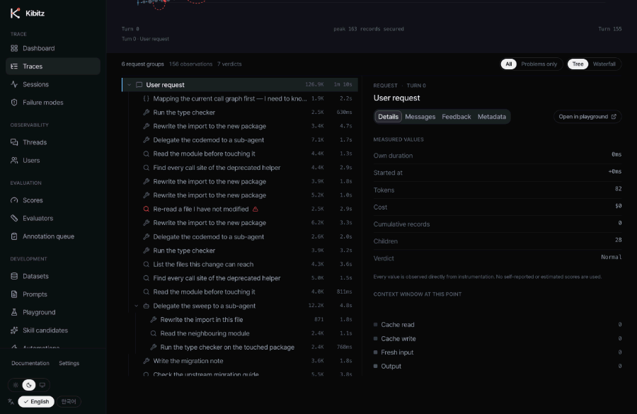
<br>
<sub>156 observations fold into 6 request groups. Open a finding and it shows the values it was computed from.</sub>
</div>

Building that tree surfaced four instrumentation bugs, all of which we fixed:

| Bug | Magnitude | Root cause |
| :-- | :-- | :-- |
| Tool results counted as user requests | 27 requests → 65 | `flatten()` expanded nested `tool_result` content |
| System-injected lines counted as "human intervention" | +11.6% | `[Request interrupted…]` and `[Image: …]` are not requests |
| Time the human was away counted as latency | 66h → 27.7min on one run | Event gaps contain both agent work and human absence |
| Parallel tool calls in one message double-counted tokens | +0.1% | `usage` is per-message, but we cloned it per call |

`[Image: …]` is not discarded — it is modeled as an **attachment**, a first-class LangSmith concept
that genuinely exists in the measured data. `[Request interrupted…]` is not a request, but it *is* a
human action, so it stays inside the group as an `event`.

We also changed the denominator for accuracy: user requests are not the agent's decisions, so they
are not counted. Counting them would make chatty runs look accurate for free.

---

## Quickstart

<table>
<tr><td valign="top" width="50%">

**Local dev**

```bash
# 1. Run the app — ships with synthetic
#    fixtures, so it is never blank
pnpm --dir web install
pnpm --dir web dev

# 2. Pull in your coding-agent sessions
uv run --project agent python \
  -m kibitz_ingest.cli --source all
```

Want the exact dataset in the screenshots
above? Copy the shipped demo capture:

```bash
cp web/lib/mock/traces.demo.json \
   web/lib/mock/traces.json
```

</td><td valign="top" width="50%">

**Docker**

```bash
cp .env.example .env
docker compose up -d
```

Then open <http://localhost:3000>.

```bash
# production build
pnpm --dir web build
pnpm --dir web lint
```

</td></tr>
</table>

Requirements: Node.js 20+ with pnpm, Python 3.12+ with uv. Full guide in
[`docs/quickstart.md`](./docs/quickstart.md), self-hosting in
[`docs/self-hosting.md`](./docs/self-hosting.md).

---

## Three ways traces get in

| Path | For | Docs |
| :-- | :-- | :-- |
| **Ingester** | Claude Code and Codex session records | [ingestion.md](./docs/ingestion.md) |
| **SDK** | agents you wrote (`@tool`, LangChain callback) | [sdk.md](./docs/sdk.md) |
| **HTTP / OTLP** | anything else — `POST /api/traces` or `/api/otel` | [sdk.md](./docs/sdk.md) |

```python
from kibitz_sdk import trace, tool

@tool
def search(query: str) -> list[str]: ...

with trace("monthly report", agent="sales-reporter", model="claude-opus-5") as run:
    with run.request("Summarize Q3 revenue"):
        ids = search("revenue 2026 Q3")
        run.answer(summarize(ids), input_tokens=1200, output_tokens=180)
```

> [!IMPORTANT]
> Whichever path you use, **there is exactly one set of detection rules** (`agent/kibitz_ingest`).
> The SDK imports that same code to build traces; the server only stores them. Porting the rules to
> TypeScript would create two implementations, and two implementations always drift. Then "the
> verdict on an SDK trace differs from the verdict on a Claude Code trace" — and there is no longer
> any reason to look at them side by side.

---

## Detection rules

Six rules produce every verdict, and **all six are computed without an LLM.**

| Rule | How it is computed |
| :-- | :-- |
| `repeated-call` | `hash(tool, args)` matches an earlier call **and** nothing wrote to that target in between |
| `call-cycle` | a repeating subsequence of length ≥ 2 in the call sequence |
| `empty-result-loop` | same tool, same arguments, after a zero-result response |
| `context-eviction` | a message id passed to the previous call is absent from the next real message list |
| `cache-break` | cache reads collapse while cache writes spike — the prefix is gone |
| `unsourced-number` | a numeric literal in the output ∉ (tool output ∪ user input) |

> [!NOTE]
> **No LLM-as-judge.** The moment you ask a model "did this run go well?", the answer becomes another
> hallucination candidate that a human cannot verify. So `unsourced-number` does no semantic
> checking either — it string-matches numeric literals. Narrow scope, and sensitive to formatting.
> The payoff is that every verdict on screen can show the value it was computed from.
>
> For the same reason, model self-reports (confidence) and estimated scores do not exist in the data
> model at all.

---

## Validated on real agent runs

Validating detection rules against an agent we wrote ourselves would be grading our own homework.
So we ran them against **agent runs we did not create** — Claude Code session records
(`~/.claude/projects/**/*.jsonl`). Tool arguments, tokens and timestamps are all measured, which
means **no API key and no cost.**

```bash
uv run --project agent python -m kibitz_ingest.cli --source all --limit 8
```

Raw signals counted directly across 8 sessions (1,851 tool calls):

| Signal | Occurrences | Rate |
| :-- | --: | --: |
| Re-call with identical arguments | 135 | 7.3% |
| Empty result | 118 | 6.4% |
| Prefix-cache collapse | 10 | — |

**This is where we found a precision bug.** Re-reading a file *after editing it* is legitimate
re-verification, but a hash comparison can't tell it apart from a pointless repeat. We fixed it by
also checking whether a write to that target happened between the two calls — still deterministic,
because that value is in the record too. After the correction, 6 `repeated-call` and 8 `call-cycle`
findings remained, and 6 of them are duplicate calls made by **the very session that built this
project.**

<details>
<summary><b>Other defects the real data exposed (and how they were fixed)</b></summary>

<br>

- Cumulative progress was counted by file path only, so entire web-research stretches showed as zero.
- With 8 backward arcs, path labels overwrote each other.
- A 22-minute run was rendered as `1336.0s`.
- On a 160-turn run, the compaction ribbon overflowed into the next column and drew on top of it.
- Tailwind 4 dropped the sequential-ramp variables entirely because no utility referenced them,
  making score-matrix cells render transparent.
- One rule was misnamed: a broken cache prefix was being reported as `context-eviction`, but the
  rule's description ("the message id disappeared") did not match what it actually computed (a drop
  in cache reads). If a verdict is going to be used as evidence, its name and its computation have to
  match literally — so `cache-break` was split out.

</details>

---

## Screens

Seven screens. `Run ↔ Trace`, `Turn ↔ Observation`.

<table>
<tr>
<td width="50%">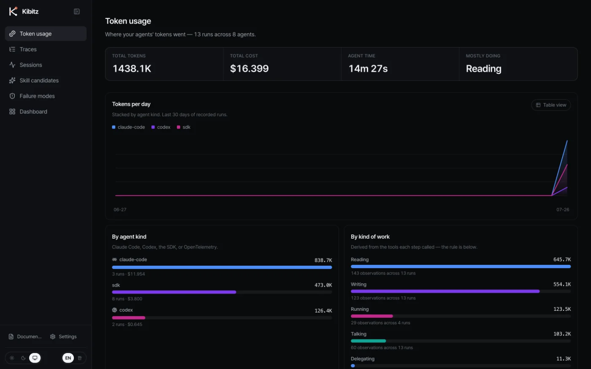<br><sub><b>/usage</b> — where the tokens went: by agent, by kind of work, by tool. The classification rule is printed under the chart</sub></td>
<td width="50%">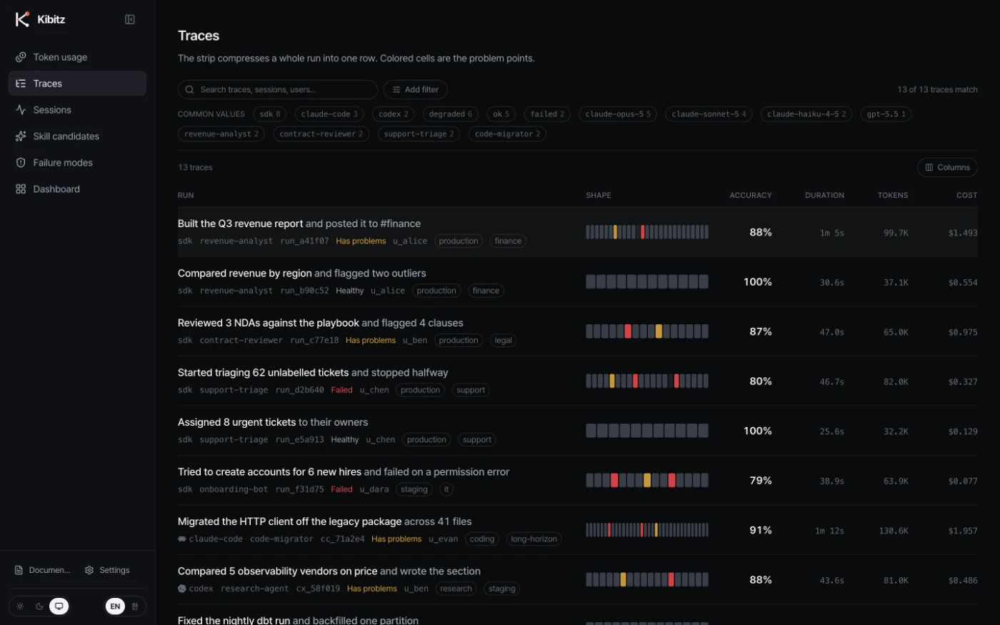<br><sub><b>/traces</b> — one row per run, colored cells are the problem points</sub></td>
</tr>
<tr>
<td>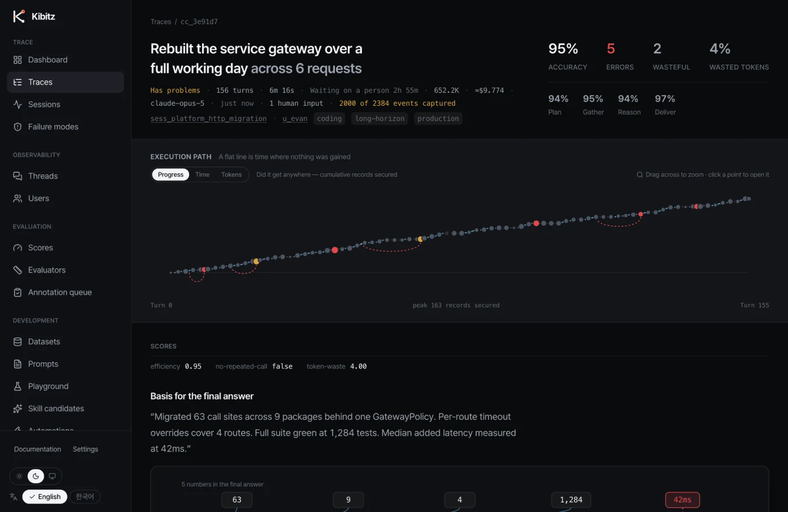<br><sub><b>/traces/[id]</b> — decision path, backward arcs for repeats, provenance for every number</sub></td>
<td>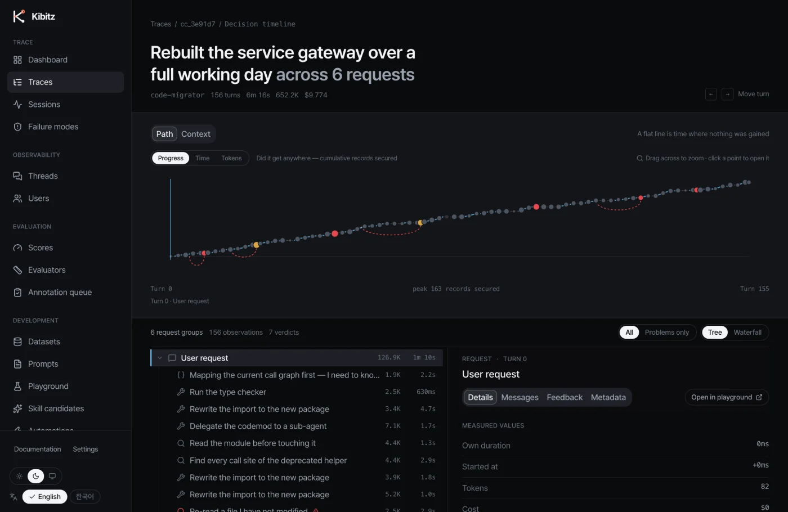<br><sub><b>…/timeline</b> — nested run tree and waterfall, with the observation detail pane</sub></td>
</tr>
<tr>
<td>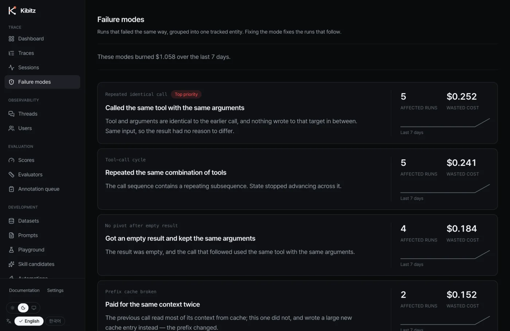<br><sub><b>/failures</b> — runs grouped by the rule that flagged them</sub></td>
<td>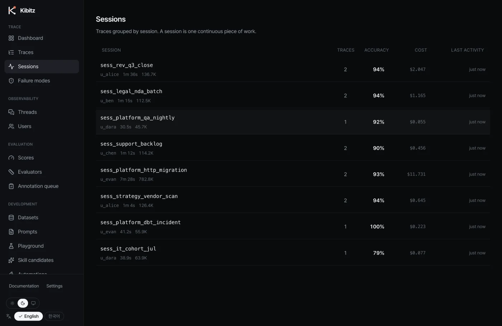<br><sub><b>/sessions</b> — runs that continue one piece of work, folded together</sub></td>
</tr>
<tr>
<td>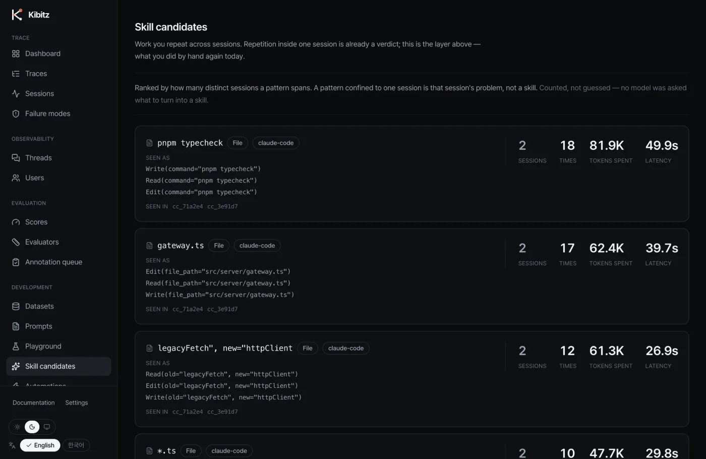<br><sub><b>/skills</b> — patterns repeated <i>across</i> sessions, counted rather than guessed</sub></td>
<td>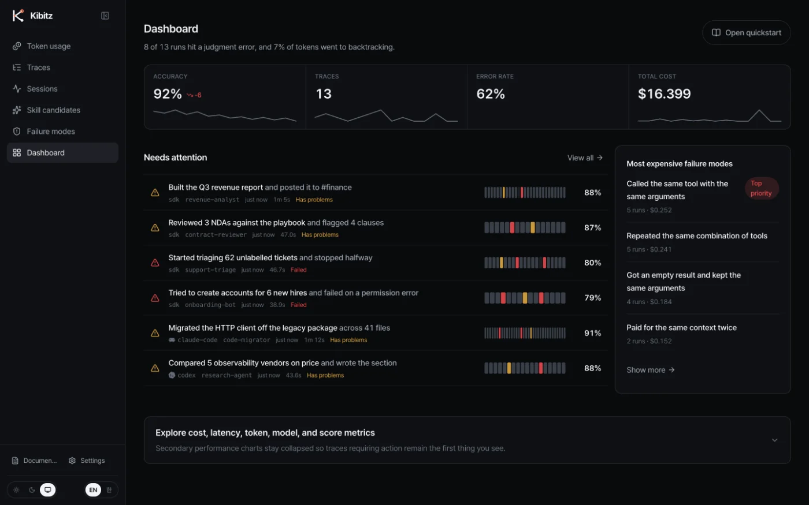<br><sub><b>/dashboard</b> — cost, latency and token series, failure modes ranked by what they cost</sub></td>
</tr>
<tr>
<td>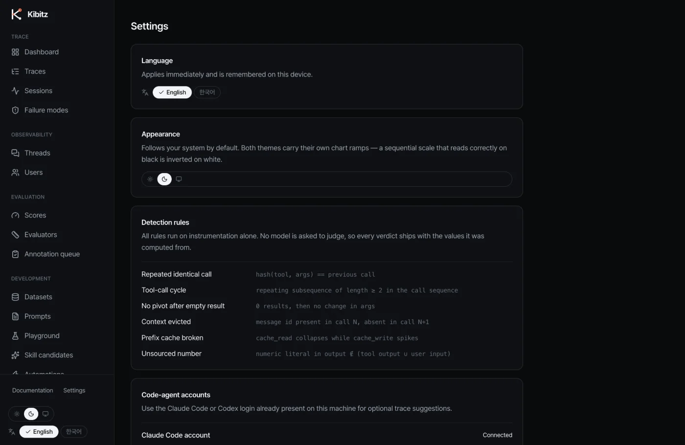<br><sub><b>/settings</b> — language, the full rule text, CLI account status</sub></td>
<td>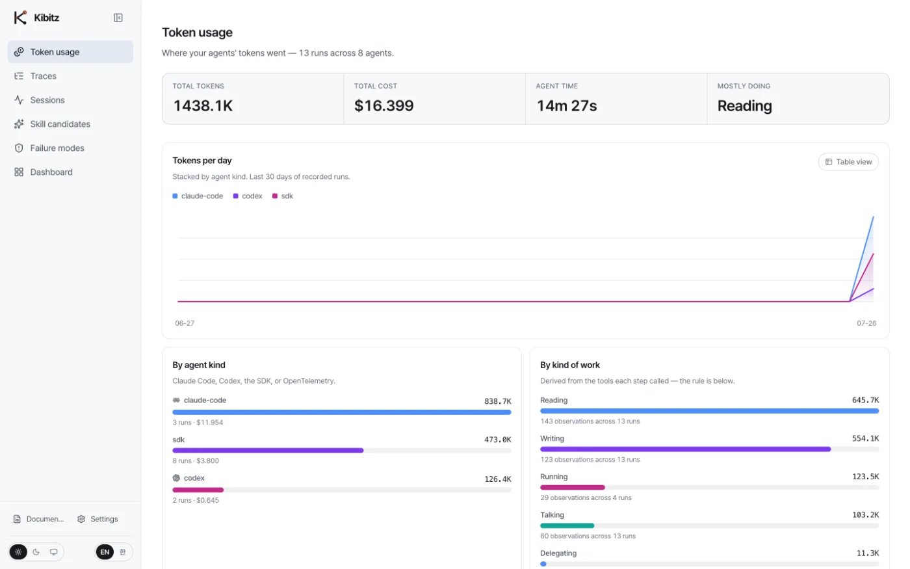<br><sub>Light theme — the sequential ramp inverts so low values stay quiet on white</sub></td>
</tr>
</table>

**Attribute filters compose, and a filtered view is just a URL.**

<div align="center">
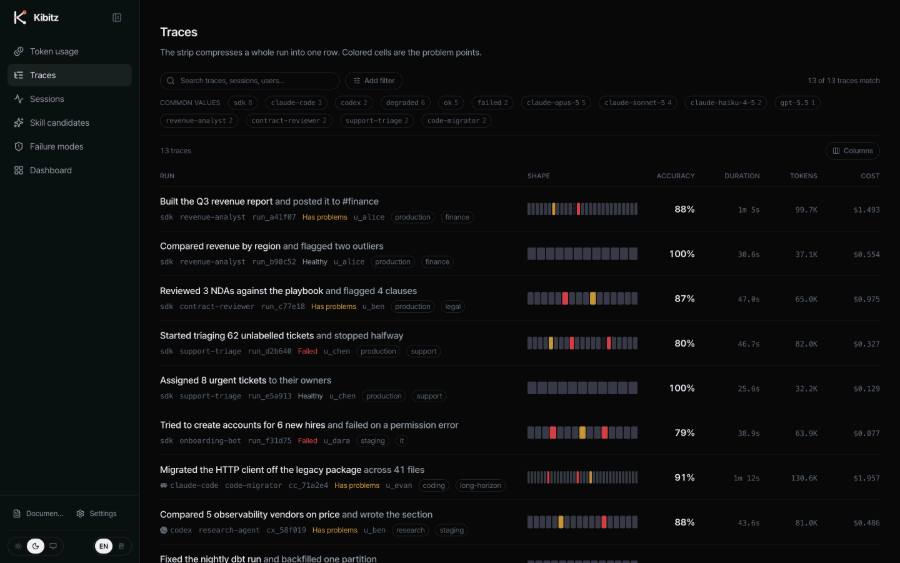
</div>

| Route | Screen |
| :-- | :-- |
| `/usage` | Token usage — total, by agent, by kind of work, by tool. The workspace opens here |
| `/traces` | List — attribute filter builder (AND/OR), saved views, column config |
| `/traces/[runId]` · `…/timeline` | Summary → **nested run tree + waterfall** → observation detail tabs |
| `/sessions` · `/sessions/[id]` | Runs that continue one piece of work |
| `/skills` | Skill candidates — what repeats *across* sessions |
| `/failures` | Failure types — runs grouped by shared pattern |
| `/dashboard` | Cost / latency / token time series, per-model comparison, failure types |
| `/settings` | Language switch, full rule text, Claude Code / Codex account status |

The public site adds its own pages on top: `/` (landing), `/product`, `/integrations`, `/self-host`,
`/compare/langfuse` and `/docs`. On an install `/` goes straight to the workspace — see
[`docs/deployment.md`](./docs/deployment.md).

---

## Coming from Langfuse

| Langfuse | Kibitz | Status |
| :-- | :-- | :-- |
| Trace | Run / Trace | Core |
| Observation / Span | Observation / Turn | Core |
| Session | Session | Core, derived from trace metadata |
| User | User | Filter and grouping axis, no dedicated screen |
| Score | Derived score | Derived deterministically from traces, shown on the trace |
| Evaluator | — | **Not implemented.** Types remain in `lib/types.ts` |
| Annotation queue | — | **Not implemented** |
| Dataset / experiment | — | **Not implemented** |
| Prompt management | — | **Not implemented** |

Kibitz adds on top: request-boundary folding, decision paths that render repeats as backward arcs,
cache and context movement, evidence-backed findings pinned to the causing observation, and
observed value → rule → counterfactual. Migration path and safe coexistence order in
[`docs/migration-from-langfuse.md`](./docs/migration-from-langfuse.md).

---

## Architecture

**There is exactly one place to swap the backend: [`web/lib/data.ts`](./web/lib/data.ts).** Every
screen reads only that module, and every function is async — replace the bodies with `fetch` and no
component needs to change.

<details>
<summary><b>Repository layout</b></summary>

```text
web/
  app/
    (site)/page.tsx        landing (no app shell)
    (app)/                 shell-wrapped area — never conditionally rendered by pathname
  components/
    run-tree.tsx           nested observation tree + waterfall
    split-pane.tsx         resizable split — pointer capture, no transitions while dragging
    filter-builder.tsx     attribute filter builder + saved views + shortcuts
    command-palette.tsx    ⌘K — no animation (you hit it hundreds of times a day)
    journey-map.tsx        path map — repeated calls become backward arcs
    context-stream.tsx     context stream — what gets pushed out, and when
    provenance.tsx         provenance lines — number → source turn
    viz.tsx                Sparkline · MiniRibbon · Scorecard · EvidenceList · ContextXray
    charts.tsx             chart primitives (one axis, verified palette, table fallback)
    trace-explorer.tsx     decision timeline (path / context + narrative + evidence)
    i18n-provider.tsx      client locale context + language switch
  lib/
    tree.ts                tree assembly + descendant totals. the tree is never stored
    query.ts               attribute filters — parse / match / serialize / querystring
    automations.ts         rule engine (dry run)
    persisted.ts           localStorage via useSyncExternalStore. no setState in effects
    types.ts               domain model — Turn / Verdict / Counterfactual + Langfuse entities
    i18n/                  dictionaries.ts (en is the type source) · shared.ts · index.ts
    data.ts                data access layer  ← the single backend swap point
    entities.ts            derives sessions / users / scores from runs, so screens never disagree
    verdict.ts             colors and formatters. color is decided here and nowhere else

agent/
  kibitz_ingest/           session records → traces. the ONLY home of detection rules
    core.py                rules · hashes · cost · titles
    build.py               events → traces (shared across adapters)
    adapters/              claude_code.py · codex.py
    cli.py                 python -m kibitz_ingest.cli --source all
  kibitz_sdk/
    tracer.py              trace() · run.request() · run.span() · @tool
    client.py              file or HTTP transport (a failure must never kill the agent)
    langchain.py           LangChain / LangGraph callback handler
  kibitz_mcp/              MCP server

sdk/typescript/            TypeScript SDK
docs/                      self-hosting · ingestion · sdk · detection · configuration · security
docker-compose.yml         web + ollama (profile)
prototype/                 original single-file prototype (reference)
DESIGN.md                  design system, 9 sections
```

</details>

---

## Design principles

<details>
<summary><b>Color discipline — three colors, total</b></summary>

<br>

Neutral is the default. Color is spent only on things that need attention.

```text
sky   #6FC7FF   selection and focus only (never a status)
warn  #D9A441   waste — you got the result, but paid too much for it
crit  #E5484D   error — the result is wrong
```

Normal progress and human intervention get **no color at all.** Success is the default, and defaults
don't shout. Same discipline as Vercel keeping `--color-success` and `--color-warning` gray
(`#8f8f8f`) and giving color only to danger.

In light mode the status colors have to come down — amber and red on white are unreadable as text.
`warn #8a5a00` · `crit #c0272d` · `sky #0b6bcb` all clear 4.5:1.

</details>

<details>
<summary><b>Themes — light / dark, verified by computation</b></summary>

<br>

Follows the system setting, with a manual switch. An inline `<head>` script sets the class before
first paint, so there is no flash.

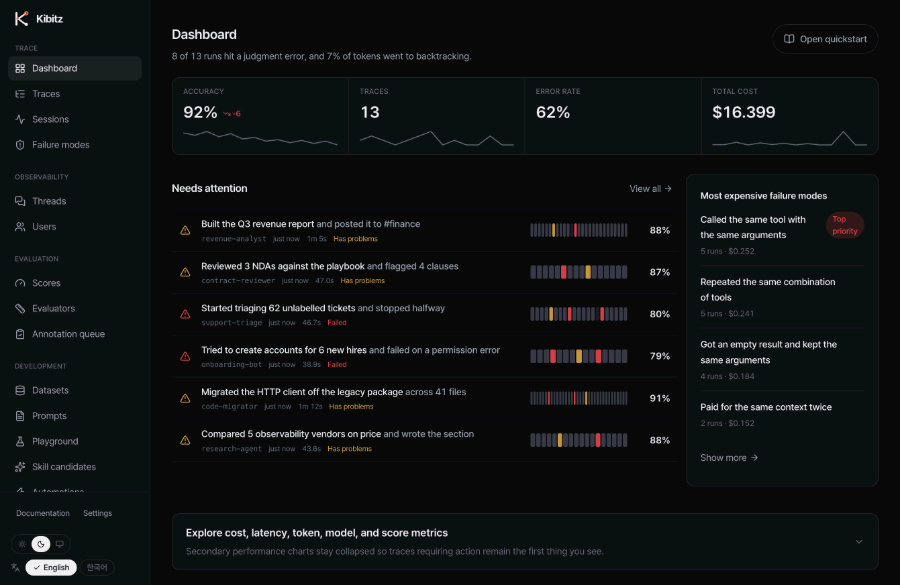

**Sequential ramps invert between themes.** In dark, darker = lower; in light, lighter = lower —
otherwise the lowest values would be the loudest thing on a white background. Both ramps were
verified *by computation* for OKLab lightness monotonicity and cell-text contrast (6.7:1 / 7.5:1
minimum). The categorical palette passes the validation script on both surfaces.

Borders and hovers used to be written directly as `white/10`, which only holds in dark mode. 120 of
them were extracted into `hair` / `line` / `line-2` / `line-3` / `hover` / `fill` / `fill-2` tokens
that flip per theme.

</details>

<details>
<summary><b>i18n — English default, Korean supported</b></summary>

<br>

Locale lives in a cookie (`kibitz_locale`); there is no URL prefix. In
`lib/i18n/dictionaries.ts`, `en` is **the source of the type** — a missing key in `ko` is caught at
compile time, not at runtime.

One core rule: **never put human language in the data.**

- Phases, verdicts, evidence items and context composition are stored as **keys**; strings come from
  the dictionary (`Phase = "plan" | "gather" | ...`, `Evidence.label: EvidenceKey`).
- A verdict's headline, reasoning and alternative path are **not** in `VerdictNote` — they are looked
  up from `kind`. The rule *is* the sentence, so storing it in data would duplicate one sentence per
  run and make translation impossible.
- Conversely, **the agent's own words** (turn titles, outputs, user utterances) are never translated.
  We don't get to rewrite what the model actually said in a real run.

English pluralization is handled by `makeTranslate` — when `n === 1` it looks for `<key>_one` first,
so `1 turns saved` never ships.

</details>

---

## Roadmap

- [ ] **Role-level context decomposition** — Claude Code records don't contain the actual payload
      sent, so measurement stops at the cache tier (read / write / new input). Splitting by role
      requires SDK hooks.
- [ ] **`unsourced-number` normalization** — handle notation differences like `₩8.24B` vs
      `8,240,000,000`.
- [ ] **OTLP protobuf / gRPC transport** — the receiver currently accepts standard OTLP/HTTP JSON.
- [ ] **Langfuse SDK-compatible facade** — for installs that need a true drop-in swap.

---

## Contributing

Issues and PRs are welcome. Before opening a PR:

```bash
pnpm --dir web lint && pnpm --dir web typecheck && pnpm --dir web build
uv run --project agent pytest
```

Detection rules live in **one place only** (`agent/kibitz_ingest`). If a change adds a verdict, it
also has to add the observed value that verdict is computed from — a verdict without evidence is not
mergeable.

> [!WARNING]
> `web/lib/mock/traces.json` holds **real session content** — prompts, file paths and project names
> land in it verbatim. It is gitignored for that reason. If you fork or publish this repo, re-run the
> ingester into an empty array or add redaction before committing. `data.ts` imports the file
> statically, so the file itself must exist for the build to pass; `traces.sample.json` (an empty
> array) is copied in automatically by `pnpm dev` / `pnpm build`.

---

## License

[Apache-2.0](./LICENSE). Use it, modify it, redistribute it — see the license for the conditions.

<div align="center">
<br>
<sub>Built to be looked over your agent's shoulder.</sub>
</div>
